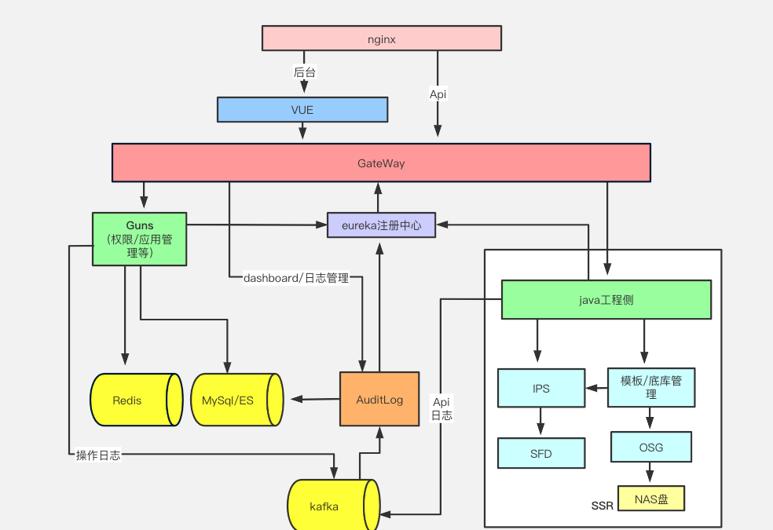
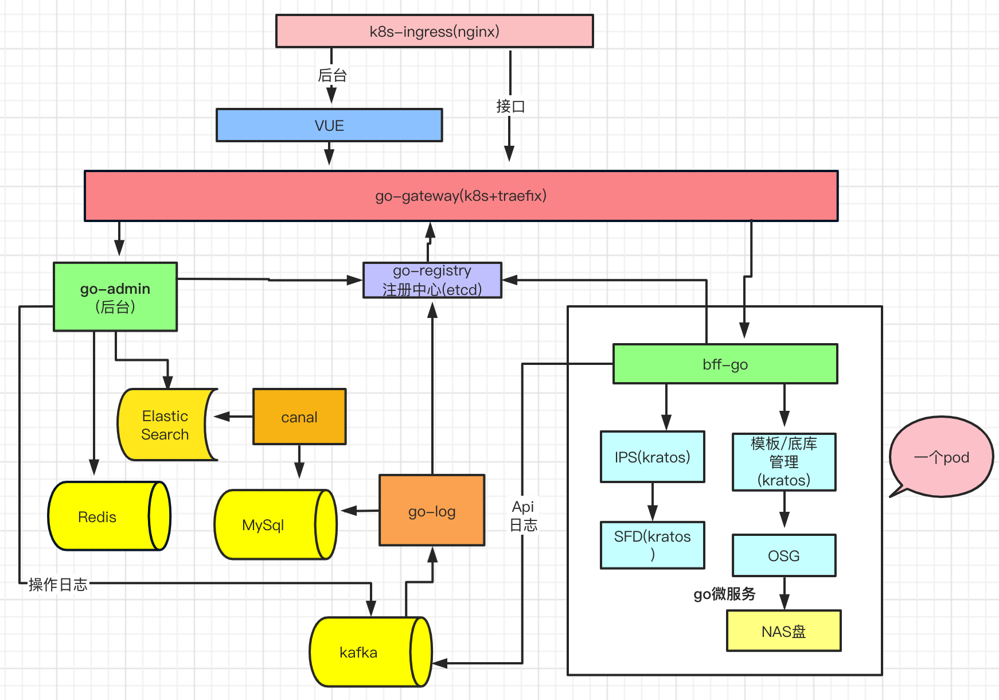

## 项目改造目录

+ [服务架构与治理](#服务架构与治理)  
  + [目前架构](#目前架构图)  
  + [微服务优化后](#微服务优化后)  
  + [改造后如图](#改造后如图)
+ [工程化](#工程化)  
  + [error处理](#error处理现状)
  + [组织目录](#组织目录)
  + [依赖注入](#依赖注入)
+ [毕业总结](#毕业总结)
+ [感谢](#感谢)

## 目前架构图
 

该架构是采用java+golang 开发，java后台采用guns框架。gateway采用springcloud-gateway，注册中心采用eureka

## 微服务优化后
1、采用golang框架Kratos改造微服务，包含bff-go，go-admin，go-log，go-registry,go-gateway等

2、添加golang bff层，负责对外服务，内部采用grpc通信，并注册到go-Registry

3、添加cancl 数据同步到es，后台运营查询压力下放

## 网关

采用k8s + traefix，使用rancher2管理，
tracefix集成forward 中间件进行auth，可以用来验证token + etcd client

## 注册中心

使用etcd 服务发现与注册

### 改造后如图
 

### 毕业总结

go进阶训练营对于我个人是收获颇丰的，触发了很多思考，知识成体系，还需要深挖才能变成自己的，加油

希望年后找到满意的