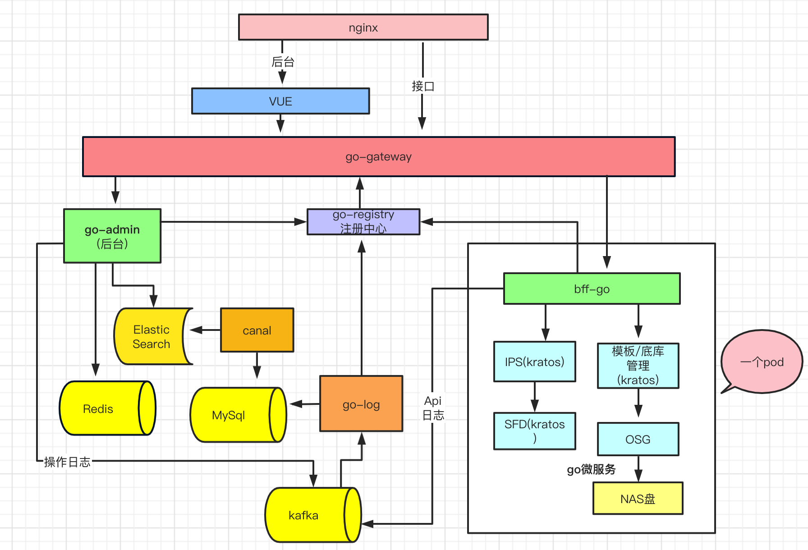

## 项目改造目录

+ [服务架构与治理](#服务架构与治理)  
  + [依赖关系](#依赖关系)  
  + [服务隔离](#服务隔离)  
  + [资源隔离](#资源隔离)
+ [工程化](#工程化)  
  + [error处理](#error处理现状)
  + [组织目录](#组织目录)
  + [依赖注入](#依赖注入)
+ [总结](#总结)
+ [感谢](#感谢)

## 目前架构图
 

该架构是采用java+golang 开发，java后台采用guns框架。gateway采用springcloud-gateway，注册中心采用eureka

## 微服务优化后
1、采用golang框架Kratos改造微服务，包含bff-go，go-admin，go-log，go-registry,go-gateway等

2、添加golang bff层，负责对外服务，内部采用grpc通信，并注册到go-Registry

3、添加cancl 数据同步到es，后台运营查询压力下放

### 改造后如图
 
